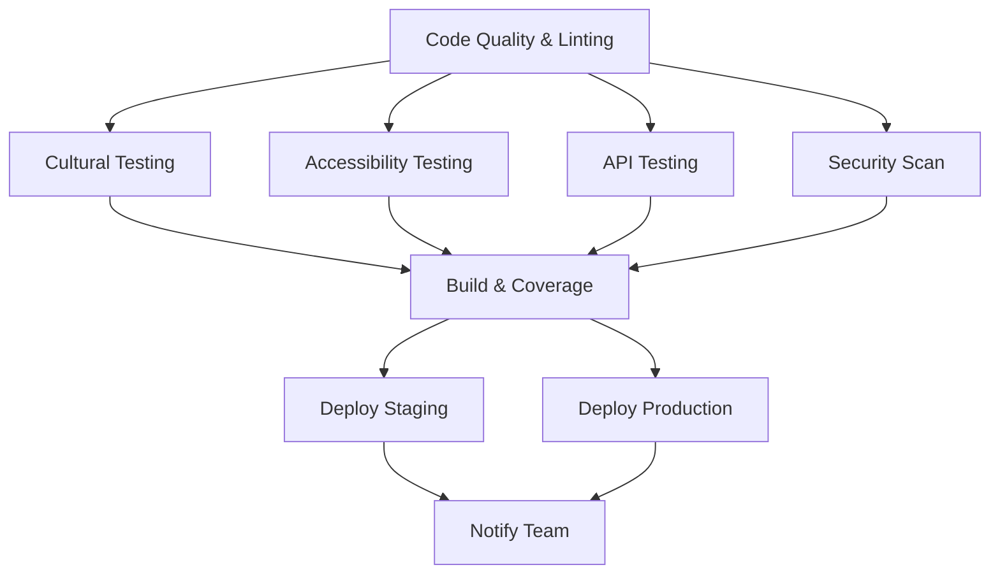

# PlateWise CI/CD Pipeline Guide

## 🔄 Continuous Integration/Continuous Deployment

PlateWise uses a comprehensive CI/CD pipeline that ensures cultural sensitivity, accessibility compliance, and code quality with every code change.

## 🎯 Why CI/CD is Critical for PlateWise

### **Cultural Sensitivity Automation**
- **Prevents cultural insensitivity** from reaching production
- **Tests all dietary restrictions** (Halal, Kosher, Vegetarian, Vegan)
- **Validates multi-language support** (English, Spanish, Arabic, Chinese, Hindi, French)
- **Checks cultural color schemes** to avoid insensitive combinations

### **Accessibility Compliance Automation**
- **Ensures WCAG 2.1 AA compliance** with every deployment
- **Tests screen reader compatibility** automatically
- **Validates keyboard navigation** for all interactive elements
- **Checks color contrast ratios** (4.5:1 for normal text)

### **API Integration Reliability**
- **Tests all external APIs** (OpenAI, Kroger, Spoonacular, ElevenLabs)
- **Validates Supabase integration** with cultural preferences
- **Ensures error handling** works in multiple languages
- **Tests real-time subscriptions** and database operations

## 🚀 Pipeline Overview

### **Trigger Events**
- **Push to `main`**: Triggers full pipeline + production deployment
- **Push to `develop`**: Triggers full pipeline + staging deployment
- **Pull Requests**: Triggers testing pipeline (no deployment)

### **Pipeline Jobs (9 Total)**



## 📋 Detailed Job Breakdown

### **1. 🔍 Code Quality & Linting**
```yaml
- ESLint code quality checks
- TypeScript compilation (if applicable)
- Code formatting validation
```

### **2. 🌍 Cultural Sensitivity Testing**
```yaml
- Tests across 6 languages: en, es, ar, zh, hi, fr
- Validates dietary restriction badges
- Checks cultural color schemes
- Tests RTL language support
- Matrix strategy for comprehensive coverage
```

### **3. ♿ Accessibility Compliance Testing**
```yaml
- WCAG 2.1 AA compliance validation
- Screen reader compatibility testing
- Keyboard navigation verification
- Color contrast ratio checking
- Axe accessibility audit
```

### **4. 🔌 API Integration Testing**
```yaml
- Supabase authentication with cultural preferences
- Database migration testing
- External API mocking and error handling
- Multi-language error message validation
```

### **5. 🔒 Security & Dependency Scanning**
```yaml
- npm audit for vulnerable dependencies
- Snyk security vulnerability scanning
- Dependency license compliance
```

### **6. 🏗️ Build & Coverage Report**
```yaml
- Application build verification
- Test coverage reporting (80% minimum)
- Codecov integration
- Artifact generation for deployment
```

### **7. 🚀 Deploy to Staging (develop branch)**
```yaml
- Automatic deployment to staging environment
- Supabase migration application
- Environment-specific configuration
- Staging URL: https://platewise-staging.vercel.app
```

### **8. 🌟 Deploy to Production (main branch)**
```yaml
- Production deployment with approval
- Database migration application
- GitHub release creation
- Production URL: https://platewise.app
```

### **9. 📢 Team Notification**
```yaml
- Slack notifications for success/failure
- Deployment status updates
- Coverage report summaries
```

## 🔧 Required Secrets Configuration

### **GitHub Repository Secrets**
Add these secrets in GitHub Settings → Secrets and variables → Actions:

```bash
# Vercel Deployment
VERCEL_TOKEN=your_vercel_token
VERCEL_ORG_ID=your_vercel_org_id
VERCEL_PROJECT_ID=your_vercel_project_id

# Supabase
SUPABASE_ACCESS_TOKEN=your_supabase_access_token
SUPABASE_STAGING_REF=your_staging_project_ref
SUPABASE_PRODUCTION_REF=your_production_project_ref

# Code Coverage
CODECOV_TOKEN=your_codecov_token

# Security Scanning
SNYK_TOKEN=your_snyk_token

# Notifications
SLACK_WEBHOOK_URL=your_slack_webhook_url
```

### **Vercel Environment Variables**
Configure these in Vercel Dashboard → Project Settings → Environment Variables:

```bash
# Supabase
@supabase-url=https://your-project.supabase.co
@supabase-anon-key=your_supabase_anon_key

# OpenAI
@openai-api-key=your_openai_api_key

# Kroger API
@kroger-client-id=your_kroger_client_id
@kroger-client-secret=your_kroger_client_secret

# Spoonacular API
@spoonacular-api-key=your_spoonacular_api_key

# Edamam API
@edamam-app-id=your_edamam_app_id
@edamam-app-key=your_edamam_app_key

# ElevenLabs API
@elevenlabs-api-key=your_elevenlabs_api_key

# Google Places API
@google-places-api-key=your_google_places_api_key
```

## 🌍 Multi-Environment Setup

### **Staging Environment**
- **URL**: https://platewise-staging.vercel.app
- **Branch**: `develop`
- **Database**: Staging Supabase project
- **Purpose**: Testing and validation before production

### **Production Environment**
- **URL**: https://platewise.app
- **Branch**: `main`
- **Database**: Production Supabase project
- **Purpose**: Live application for users

## 📊 Quality Gates

### **Required Checks Before Deployment**
- ✅ **Code Quality**: ESLint passes with 0 errors
- ✅ **Cultural Tests**: All 6 languages pass cultural sensitivity tests
- ✅ **Accessibility**: WCAG 2.1 AA compliance verified
- ✅ **API Tests**: All integrations working correctly
- ✅ **Security**: No high-severity vulnerabilities
- ✅ **Coverage**: Minimum 80% test coverage
- ✅ **Build**: Application builds successfully

### **Deployment Approval Process**
1. **Automatic Staging**: `develop` branch auto-deploys to staging
2. **Manual Production**: `main` branch requires manual approval
3. **Rollback**: Automatic rollback on deployment failure

## 🚨 Failure Handling

### **Test Failures**
```yaml
# Cultural sensitivity test failure
- Pipeline stops deployment
- Slack notification sent
- Detailed logs available in GitHub Actions
- Developer must fix cultural issues before merge
```

### **Accessibility Failures**
```yaml
# WCAG compliance failure
- Deployment blocked
- Axe audit report generated
- Accessibility issues must be resolved
- Re-run pipeline after fixes
```

### **Security Vulnerabilities**
```yaml
# High-severity vulnerability detected
- Deployment blocked
- Security team notified
- Vulnerability must be patched
- Dependencies updated before deployment
```

## 📈 Monitoring & Alerts

### **Pipeline Monitoring**
- **GitHub Actions**: Real-time pipeline status
- **Vercel Dashboard**: Deployment status and logs
- **Codecov**: Test coverage trends
- **Slack**: Team notifications

### **Application Monitoring**
- **Vercel Analytics**: Performance monitoring
- **Supabase Dashboard**: Database performance
- **Error Tracking**: Automatic error reporting
- **Uptime Monitoring**: 24/7 availability checks

## 🔄 Development Workflow

### **Feature Development**
```bash
# 1. Create feature branch
git checkout -b feature/meal-planning

# 2. Develop with cultural sensitivity in mind
# 3. Write tests for cultural and accessibility compliance
# 4. Push to GitHub
git push origin feature/meal-planning

# 5. Create Pull Request to develop
# 6. CI pipeline runs automatically
# 7. Review and merge after all checks pass
```

### **Release Process**
```bash
# 1. Merge develop to main
git checkout main
git merge develop

# 2. Push to trigger production deployment
git push origin main

# 3. Monitor deployment in GitHub Actions
# 4. Verify production deployment
# 5. GitHub release created automatically
```

## 🎯 Best Practices

### **Cultural Sensitivity**
- **Test all languages** before merging
- **Validate dietary restrictions** in every feature
- **Check cultural color schemes** in UI changes
- **Test RTL language support** for Arabic/Hebrew

### **Accessibility Compliance**
- **Run accessibility tests** locally before pushing
- **Use semantic HTML** and proper ARIA labels
- **Test keyboard navigation** for all interactive elements
- **Verify color contrast** meets WCAG standards

### **API Integration**
- **Mock external APIs** in tests to avoid rate limits
- **Test error scenarios** and edge cases
- **Validate cultural data** handling in API responses
- **Check multi-language error messages**

## 🏆 Success Metrics

### **Pipeline Performance**
- **Build Time**: < 10 minutes average
- **Test Coverage**: > 80% maintained
- **Deployment Success Rate**: > 95%
- **Cultural Test Pass Rate**: 100%
- **Accessibility Compliance**: 100%

### **Quality Metrics**
- **Zero Cultural Sensitivity Issues** in production
- **Zero Accessibility Violations** in production
- **Zero High-Severity Security Vulnerabilities**
- **< 1% Error Rate** in production

Your PlateWise CI/CD pipeline ensures that every code change maintains cultural inclusivity, accessibility compliance, and high quality! 🌍♿🔌