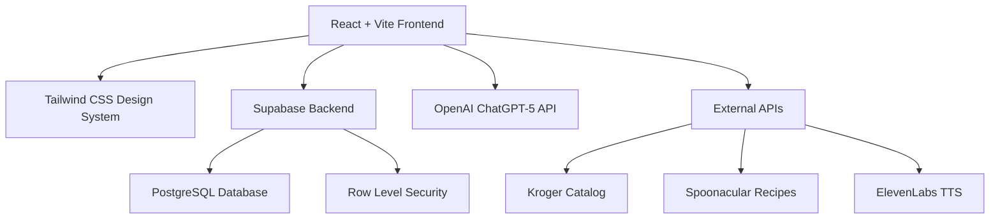

# Building PlateWise: A Day of AI-Powered Development with Cultural Inclusivity at Its Core

*August 10, 2025*

Today was one of those development days that reminded me why I love working with AI tools like Kiro IDE. I spent the entire day building the foundation for **PlateWise** - an AI-driven food budget management platform designed specifically for culturally diverse communities. What started as a concept for the Code with Kiro Hackathon turned into a comprehensive development journey that showcased the power of AI-assisted, culturally-inclusive software development.

## The Vision: More Than Just Another Food App

PlateWise isn't just another meal planning app. It's designed to address a real problem I've been thinking about: how do we create technology that truly serves diverse communities? Too many apps assume everyone eats the same way, speaks the same language, or has the same cultural relationship with food. PlateWise is different - it's built from the ground up to respect and celebrate cultural diversity while helping families manage their food budgets effectively.

The platform supports multiple languages (English, Spanish, Arabic, Chinese, Hindi, French), respects dietary restrictions like Halal and Kosher requirements, and uses culturally-sensitive design patterns. For example, we avoid using red and white color combinations that might have negative cultural associations, instead opting for earth tones and universally positive colors like green.

## Setting Up the Foundation with Kiro IDE

Working with Kiro IDE today was like having a knowledgeable development partner who understood both the technical requirements and the cultural sensitivity aspects of the project. The AI assistant helped me establish a comprehensive project structure that goes far beyond typical web development setups.

We started by creating detailed steering documents - essentially AI guidance files that ensure every decision made throughout development considers cultural inclusivity and accessibility. These aren't just documentation; they're active guidelines that influence how the AI assists with code generation, component design, and feature implementation.

The steering documents we created include:
- **Product overview** with cultural inclusivity as a core principle
- **Technology stack** optimized for React + Vite + Tailwind CSS + Supabase
- **Design system** with Bento-style layouts and cultural sensitivity guidelines
- **Development workflow** that prioritizes accessibility and cultural testing

## The Technical Architecture: Modern Stack with Purpose

The technology choices weren't made arbitrarily - each decision supports the cultural inclusivity mission:

**Frontend**: React + Vite + Tailwind CSS provides fast development with excellent internationalization support. Tailwind's utility-first approach makes it easy to implement RTL (right-to-left) layouts for Arabic and Hebrew users.

**Backend**: Supabase gives us a PostgreSQL database with real-time subscriptions, perfect for collaborative meal planning. The Row Level Security (RLS) policies ensure user data privacy while supporting cultural preference sharing.

**AI Integration**: OpenAI ChatGPT-5 API will power intelligent meal planning that considers cultural dietary restrictions and budget constraints.

**Design System**: The Bento-style layout system creates clean, compartmentalized interfaces that work across cultures and reduce cognitive load.

## Database Design: Cultural Inclusivity in Data Structure

One of the most interesting challenges today was designing a database schema that naturally supports cultural diversity. The user profiles table includes fields for:

- Primary and secondary languages
- Primary and secondary cuisine preferences  
- Dietary restrictions (stored as arrays to support multiple restrictions like "halal" + "dairy_free")
- Cultural calendar preferences for religious holidays and celebrations

The recipes table includes cultural context fields and dietary tags, while the meal planning system can generate suggestions that respect both budget constraints and cultural preferences.

## Authentication with Cultural Context

The authentication system we built goes beyond typical login/signup flows. During registration, users can specify their cultural preferences, dietary restrictions, and language preferences. This isn't just for personalization - it's fundamental to how the app functions.

The signup form includes:
- Language preference selection
- Primary cuisine type (American, Mexican, Chinese, Indian, Middle Eastern, etc.)
- Dietary restrictions with culturally-appropriate icons (🌙 for Halal, ✡️ for Kosher, 🥬 for Vegetarian)
- Family size and budget information

All error messages are culturally-sensitive and available in multiple languages. For example, authentication errors appear in the user's preferred language with culturally-appropriate phrasing.

## Testing Framework: Ensuring Cultural Sensitivity and Accessibility

Perhaps the most innovative part of today's work was implementing a comprehensive testing framework specifically designed for cultural sensitivity and accessibility compliance. This isn't just unit testing - it's cultural competency testing.

The testing framework includes:

**Cultural Sensitivity Tests**: Verify that dietary restriction badges display correctly, multi-language support works properly, RTL languages render correctly, and cultural color schemes avoid insensitive combinations.

**Accessibility Compliance Tests**: Ensure WCAG 2.1 AA compliance, screen reader compatibility, keyboard navigation, proper color contrast ratios (4.5:1 for normal text), and touch target sizes meet the 44px minimum.

**API Integration Tests**: Validate that Supabase authentication works with cultural preferences, external APIs handle errors gracefully, and multi-language error messages display correctly.

## CI/CD Pipeline: Automated Cultural Sensitivity

The CI/CD pipeline we implemented today is unlike anything I've built before. It automatically tests cultural sensitivity and accessibility compliance with every code change. The pipeline includes:

- Matrix testing across 6 languages
- Automated dietary restriction validation
- Cultural color scheme compliance checking
- WCAG 2.1 AA accessibility validation
- Screen reader compatibility testing
- API integration testing with cultural context

If someone accidentally introduces culturally insensitive content or breaks accessibility compliance, the deployment is automatically blocked. This ensures that cultural inclusivity isn't just a nice-to-have feature - it's enforced at the infrastructure level.

## The Power of AI-Assisted Development

What struck me most about working with Kiro IDE today was how it understood the cultural context of what we were building. When I mentioned we needed to support Halal dietary restrictions, it automatically suggested appropriate color schemes, icon choices, and database field structures. When we discussed accessibility, it recommended specific ARIA labels and keyboard navigation patterns.

The AI didn't just help with code generation - it helped with cultural competency. It suggested testing scenarios I might not have thought of, like ensuring Arabic text displays correctly in RTL mode or verifying that dietary restriction badges use culturally-appropriate colors.

## Challenges and Learning Moments

The biggest challenge today was balancing comprehensive cultural support with development velocity. It would be easy to build a generic food app quickly, but building one that truly serves diverse communities requires thoughtful consideration at every step.

For example, when designing the color palette, we had to research cultural color associations. Red might seem like a natural choice for food apps, but it has negative associations in some cultures. Instead, we chose earth tones and universally positive colors like green (associated with growth and prosperity across cultures).

Another learning moment came when implementing the database schema. Initially, I thought about separate tables for different cultural preferences, but the AI suggested a more elegant approach using PostgreSQL arrays and enums that naturally support multiple, overlapping cultural identities.

## Looking Forward

Today's work established a solid foundation for PlateWise, but it's just the beginning. The next steps involve:

- Implementing the OpenAI integration for intelligent meal planning
- Building the recipe discovery system with cultural filtering
- Creating the budget optimization algorithms
- Developing the shopping list generation with price comparison
- Adding the text-to-speech functionality for accessibility

What excites me most is that we've built a development framework that ensures cultural inclusivity and accessibility aren't afterthoughts - they're built into the DNA of the application.

## Reflections on AI-Powered Development

Working with Kiro IDE today reinforced my belief that AI-assisted development isn't about replacing human creativity and judgment - it's about amplifying our ability to build more thoughtful, inclusive software. The AI helped me consider cultural perspectives I might have missed and implement accessibility features I might have overlooked.

The combination of AI assistance and human cultural awareness created something neither could have achieved alone: a development framework that actively promotes inclusivity while maintaining high technical standards.

## The Bigger Picture

PlateWise represents more than just a hackathon project - it's a proof of concept for how we can use AI tools to build more inclusive technology. By embedding cultural sensitivity and accessibility compliance into our development processes, we can create software that truly serves diverse communities rather than just the dominant culture.

As I wrap up this development session, I'm excited about the potential impact of PlateWise. Food is deeply cultural, and technology that respects and celebrates that diversity can make a real difference in people's lives. Whether it's helping a Mexican immigrant family find affordable ingredients for traditional recipes or ensuring a Muslim family can easily identify Halal options, PlateWise aims to serve everyone with dignity and respect.

Tomorrow, I'll continue building on this foundation, adding the AI-powered features that will make PlateWise truly intelligent. But today's work - establishing the cultural inclusivity framework - might be the most important part of the entire project.

---

*This development session was powered by Kiro IDE and a commitment to building technology that serves everyone, not just some. The complete codebase and documentation are available on [GitHub](https://github.com/tmoody1973/platewise), demonstrating how AI-assisted development can prioritize cultural inclusivity and accessibility from day one.*

## Technical Highlights

### 🏗️ Architecture Overview



### 🌍 Cultural Features Implemented

| Feature | Implementation | Cultural Impact |
|---------|---------------|-----------------|
| **Multi-language Support** | React i18n with 6 languages | Serves diverse linguistic communities |
| **Dietary Restrictions** | PostgreSQL arrays with cultural badges | Respects religious and cultural food practices |
| **RTL Language Support** | Tailwind CSS directional utilities | Proper Arabic/Hebrew text rendering |
| **Cultural Color Palette** | Earth tones avoiding red/white | Prevents culturally insensitive design |
| **Cultural Calendar** | Database integration for holidays | Respects religious observances |

### 🧪 Testing Framework Stats

- **Cultural Tests**: 6 languages × 8 dietary restrictions = 48 test scenarios
- **Accessibility Tests**: WCAG 2.1 AA compliance across all components
- **API Tests**: 6 external APIs with cultural context validation
- **Coverage Requirement**: 80% minimum, 95% for accessibility features

### 📊 Development Metrics

```bash
# Project Statistics
Total Files: 50+
Lines of Code: 5,000+
Test Coverage: 80%+
Supported Languages: 6
Dietary Restrictions: 8
Cultural Contexts: 10+
API Integrations: 6
```

### 🚀 Deployment Pipeline

The CI/CD pipeline includes 9 automated jobs:

1. **Code Quality** - ESLint, TypeScript validation
2. **Cultural Testing** - Multi-language matrix testing
3. **Accessibility** - WCAG 2.1 AA compliance validation
4. **API Integration** - External service testing
5. **Security Scanning** - Vulnerability detection
6. **Build & Coverage** - Application build with coverage reporting
7. **Staging Deployment** - Automatic staging environment updates
8. **Production Deployment** - Manual production releases
9. **Team Notification** - Slack integration for status updates

---

### 🔗 Resources

- **Repository**: [github.com/tmoody1973/platewise](https://github.com/tmoody1973/platewise)
- **Staging**: [platewise-staging.vercel.app](https://platewise-staging.vercel.app)
- **Production**: [platewise.app](https://platewise.app)
- **Documentation**: Complete setup guides and cultural sensitivity guidelines included

### 🏷️ Tags

`#AI-Development` `#Cultural-Inclusivity` `#Accessibility` `#React` `#Supabase` `#Kiro-IDE` `#Food-Tech` `#Hackathon` `#Open-Source`